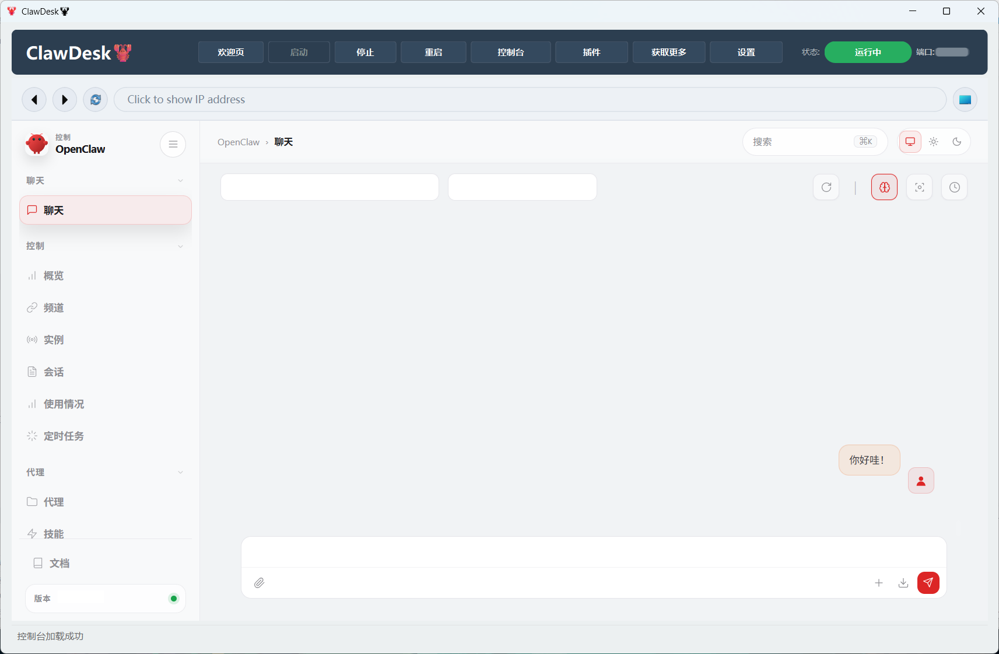
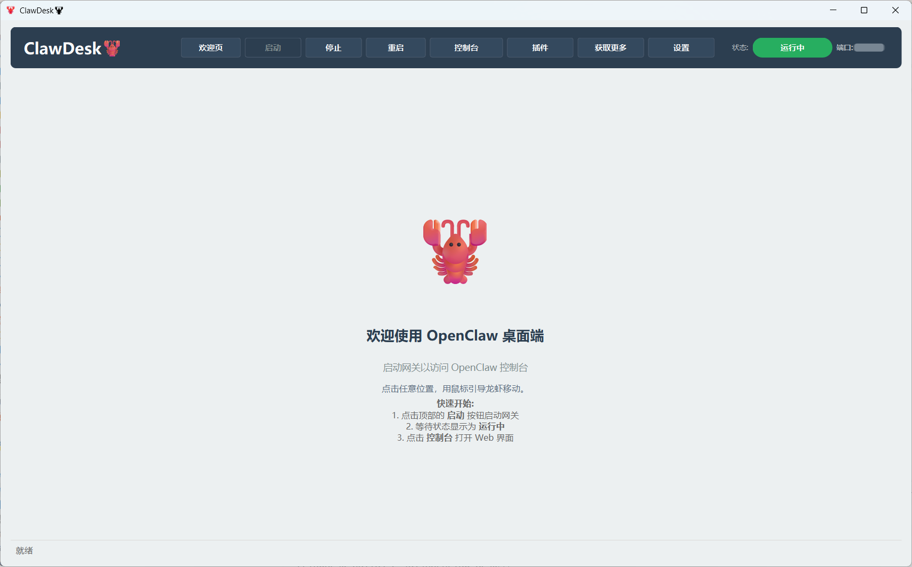

<div align="center">

# 🦞 OpenClaw Desk - 桌面龙虾

**简体中文 | [English](README.md)**

🦞 一个面向 OpenClaw Gateway 的轻量级桌面控制器，内置仪表盘视图、本地控制能力，以及更适合日常使用的 Windows 桌面工作流。

[](./LICENSE)

</div>

------

## ✨ 功能特性

- 🚀 支持启动、停止和重启本地 OpenClaw Gateway
- 📊 支持在桌面端实时查看网关状态
- 🌐 支持直接在应用内打开 OpenClaw Dashboard
- 😡 支持错误界面，可展示安装失败、网关异常和仪表盘回退信息
- 🧠 支持获取 Skills，无需回到终端执行命令
- 🧩 支持插件下载，在桌面端完成插件安装流程
- 📋 设计了独立的插件列表页，支持刷新、缓存加载以及启用 / 禁用操作
- 🔓 支持外链访问，开启暴露模式后可在内置浏览器中打开外部链接
- 🌍 支持中英双语切换
- 💾 支持配置记忆，可持久化语言、暴露模式、网关端口和窗口大小等设置
- ⚙️ 支持设置功能，可管理本地目录、端口、暴露模式、语言和应用信息
- 🖥️ 支持关闭窗口后按需保持网关继续后台运行
- 🦞 提供可交互的欢迎页，小龙虾形象可移动到指定位置

------

## ⚡ 快速开始

### 界面预览

当前桌面界面预览：





------

### 💥 直接安装

如果你只想快速使用 **ClawDesk**，无需配置 Python 环境或手动构建，可以直接下载 Windows 安装包。

1. 下载最新安装程序：
   **ClawDesk-Setup-1.0.1.exe**
   https://github.com/wobudaoa/openclaw-desk/releases/download/v1.0.1/ClawDesk-Setup-1.0.1.exe
2. 运行安装程序并按提示完成安装。

安装完成后，你可以通过以下方式启动 **ClawDesk**：

- 开始菜单中的 **ClawDesk**
- 桌面快捷方式（如果安装时勾选创建）
- 安装目录中的 `ClawDesk.exe`

------

### 从源码运行

1. 创建并激活 Python 虚拟环境。推荐使用 Conda，Python 版本建议为 **3.10 - 3.12**。
2. 在项目根目录安装依赖：

```bash
pip install -r requirements.txt
```

3. 启动应用：

```bash
python main.py
```

4. 如果你使用 Conda，也可以修改 `openclaw-desk.bat` 中的环境名 `openclaw`，改成你自己的环境后双击启动。

------

## 🫡 使用说明

- 如果通过安装包安装，按 `Win+Q` 搜索 `ClawDesk` 即可启动。
- 顶部入口可直接进入仪表盘、插件列表、错误信息页和设置页。
- `Get Plugins` 可直接在桌面端下载插件。
- `Get Skills` 可直接在桌面端获取技能。
- 插件列表页会读取当前插件状态，支持刷新，并可执行启用 / 禁用操作。
- `设置` 页面可打开本地配置目录、修改网关端口、切换暴露模式以及切换应用语言。
- 应用会记住语言、暴露模式、端口、窗口大小以及插件列表缓存等信息。
- 关闭窗口时会弹出三种选择：
  - `Yes` = 停止网关并退出
  - `No` = 保持网关运行并退出
  - `Cancel` = 留在应用内，不退出

------

## 🧩 环境要求

- Python **>=3.10, <=3.12**
- 推荐在 Windows 桌面环境中运行
- 需要本地已安装 **OpenClaw**，并且能被系统路径识别
- 如需使用内置仪表盘视图，需要 **Qt WebEngine**

如果尚未安装 OpenClaw，应用会停留在错误状态，并提示你先完成安装。

------

## 🔧 安装 OpenClaw

- GitHub: https://github.com/openclaw/openclaw
- 文档: https://docs.openclaw.ai/

------

## 📝 说明

- ClawDesk默认管理运行在 **18789** 端口上的本地 **OpenClaw Gateway** 进程，但是**可以随时在设置中更改**。
- 内置浏览器默认只访问本地地址；开启 **暴露模式** 后，页面内点击的外部 `http/https` 链接也可在内置浏览器中打开。
- 设置会写入本地 `config.json`，插件列表也会做缓存，以便下次更快加载。
- 如果 WebEngine 不可用，应用仍可展示回退界面并暴露仪表盘 URL。

------

## 📂 项目结构

```text
.
|-- main.py
|-- openclaw-desk.bat
|-- requirements.txt
|-- assets/
|   |-- emoji.png
|-- src/
|   |-- browser_view.py
|   |-- gateway_manager.py
|   |-- main_window.py
|   |-- tray_icon.py
|   `-- translations.py
|-- utils/
|   `-- emoji_icon.py
|-- README.md
`-- README.zh-CN.md
```

------

## 📜 许可证

MIT License Copyright (c) 2026 wobudaoa

OpenClaw Desk 基于 MIT License 发布。

本项目是 OpenClaw 的独立桌面封装，不隶属于 OpenClaw 官方，也未获得其背书。

完整许可文本见 `LICENSE` 文件。

------

## ⭐ Star History

<div align="center">

[](https://www.star-history.com/?repos=wobudaoa%2Fopenclaw-desk&type=date&legend=top-left)

</div>
