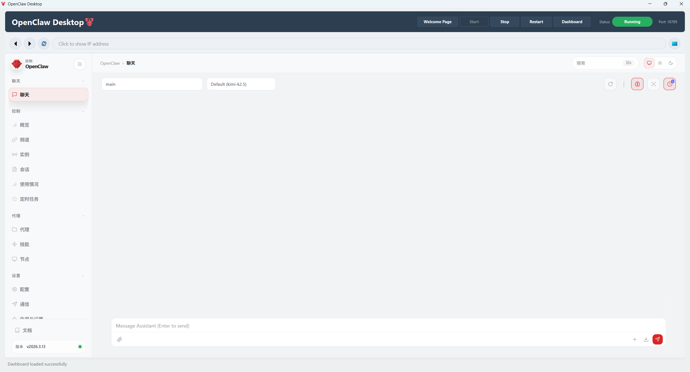
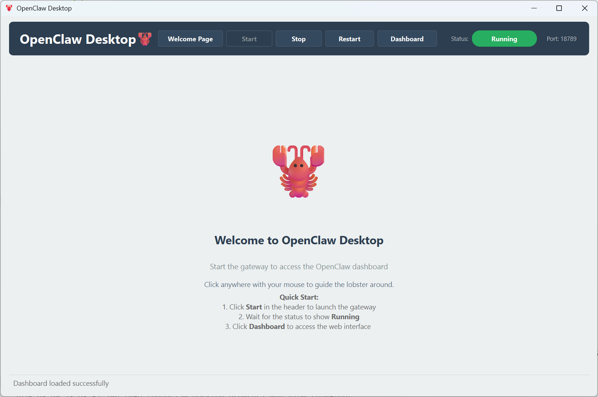

<div align="center">

# 🦞 OpenClaw Desk - 桌面龙虾

**简体中文 | [English](README.md)**

🦞 一个面向 OpenClaw Gateway 的轻量级桌面控制器，内置仪表盘视图，并提供简洁直观的本地控制面板。

[](./LICENSE)

</div>

------

## ✨ 功能特性

- 🚀 启动、停止和重启本地 OpenClaw Gateway
- 📊 实时查看网关状态
- 🌐 直接在桌面应用内打开 OpenClaw Dashboard
- 🖥️ 支持关闭程序后，后台持续运行OpenClaw（可选）
- 🦞 交互式 Welcome Page 欢迎页，可将宠物小龙虾移动到指定位置

------

## ⚡ 快速开始

### 预览

当前桌面界面预览：





------

### 💥**直接安装**

如果你只想快速使用 **ClawDesk**，无需配置 Python 环境或手动构建，可以直接下载官方提供的 Windows 安装包。

1. 直接点击连接下载本安装程序：

    **ClawDesk-Setup-1.0.0.exe**

    https://github.com/wobudaoa/openclaw-desk/releases/download/v1.0.0/ClawDesk-Setup-1.0.0.exe
   
2. 双击运行安装程序，按照提示完成安装。

安装完成后，你可以通过以下方式启动 **ClawDesk**：

- 开始菜单 → **ClawDesk**
- 桌面快捷方式（如果安装时选择创建）
- 安装目录中的 `ClawDesk.exe`

启动后即可通过桌面界面管理 **OpenClaw Gateway**，并在应用内直接打开控制面板。

------

### 从源码运行

1. 创建并激活一个 Python 虚拟环境，推荐使用 Conda，Python 版本建议为 **3.10 - 3.12**。
2. 在项目根目录安装依赖：

```bash
pip install -r requirements.txt
```

3. 启动应用：

```bash
python main.py
```

4. 如果你使用 Conda，也可以直接修改根目录中的 `openclaw-desk.bat`，将其中的环境名 `openclaw` 改成你自己的环境名，然后双击运行。下面是详细的批处理脚本内容：

```batch
@echo off
chcp 65001 >nul
title OpenClaw 启动器

echo ========================================
echo      OpenClaw 自动启动程序
echo ========================================
echo.

:: 激活conda环境，这里叫openclaw，可以改为别的名字
call conda activate openclaw	

:: 检查是否激活成功
if %errorlevel% neq 0 (
    echo [❌] 激活环境失败！请检查：
    echo     1. Conda是否正确安装
    echo     2. openclaw环境是否存在
    echo     3. 运行：conda info --envs 查看环境
    pause
    exit /b 1
)

echo [✅] Conda环境激活成功：openclaw
echo.

:: 执行Python程序
echo [🚀] 正在启动 OpenClaw Desk...
python main.py

:: 如果程序退出，暂停显示信息
echo.
echo [程序已退出]
pause
```

------

## 🫡 操作说明

- 如果从安装包安装，直接Win+Q搜索ClawDesk即可！
- 关闭时会询问以下三种情况：
    - Yes: 关闭后台网关并退出软件！
    - No： 保持网关后台运行，随时可以访问OpenClaw，同时退出软件。
    - Cancel： 留在软件内，不退出。

------


## 🧩 环境要求

- Python **>=3.10, <=3.12**
- 推荐在 Windows 桌面环境中运行
- 需要已在本地安装 **OpenClaw**，并能被系统识别
- 如果你要使用内嵌仪表盘视图，需要具备 **Qt WebEngine**

如果尚未安装 OpenClaw，应用会停留在锁定的错误状态，并提示你先完成安装。

------

## 🔧 安装 OpenClaw

- GitHub: https://github.com/openclaw/openclaw
- 文档: https://docs.openclaw.ai/

------

## 📂 项目结构

```text
.
├── main.py
├── openclaw-desk.bat
├── requirements.txt
├── assets/
│   └── emoji.png
├── src/
│   ├── browser_view.py
│   ├── gateway_manager.py
│   ├── main_window.py
│   └── tray_icon.py
├── utils/
│   └── emoji_icon.py
├── README.md
└── README.zh-CN.md
```

**文件说明**

- `assets/emoji.png`
  桌面应用使用的图标资源。
- `utils/emoji_icon.py`
  用于根据 emoji 生成自定义图标的工具脚本。

------

## 📝 说明

- 这个桌面应用默认管理运行在 **18789** 端口上的本地 **OpenClaw Gateway** 进程。
- 内嵌浏览器依赖你当前环境中的 **Qt WebEngine** 支持。
- 如果 WebEngine 不可用，应用仍可通过降级界面暴露仪表盘 URL。

------

## 📜 许可证

MIT License © 2026 wobudaoa

OpenClaw Desk 基于 MIT License 发布。

## ⭐ 星标曲线

<div align="center">

[](https://www.star-history.com/?repos=wobudaoa%2Fopenclaw-desk&type=date&legend=top-left)

</div>

本项目是 OpenClaw 的独立桌面封装，**与 OpenClaw 项目不存在隶属关系，也未获得其背书**。

完整许可证文本见 `LICENSE` 文件。
